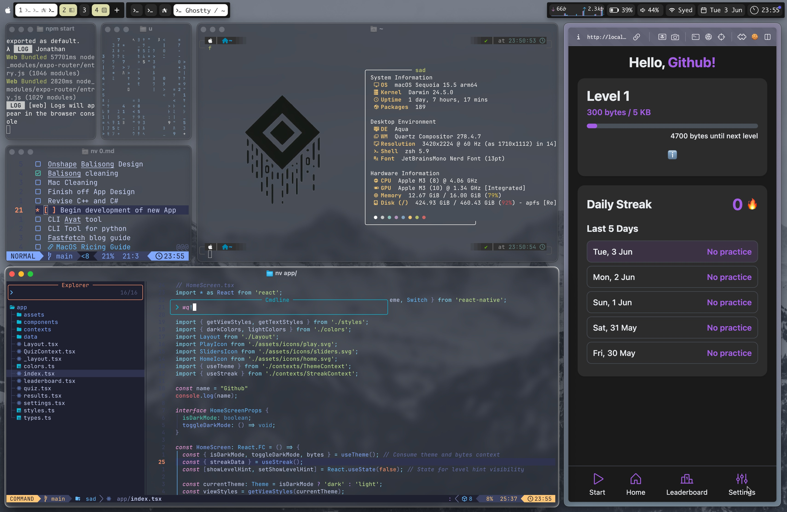
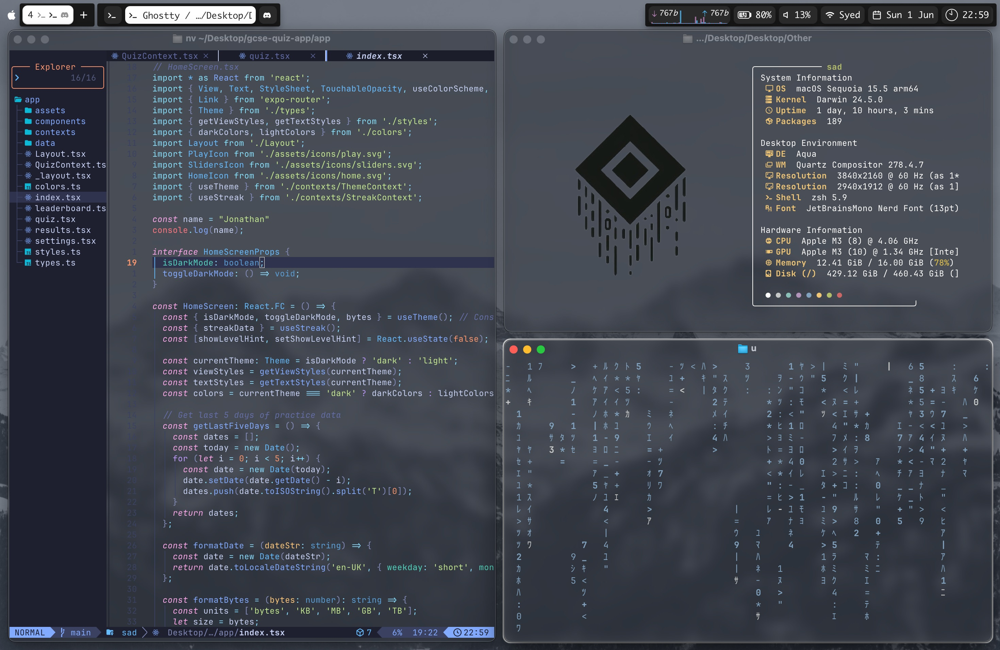

# dotfiles
My dotfiles and config.
* I use a Macbook Air M3 16/512gb, which is unfortunately limited by Silicon to only MacOS natively. However, since MacOS is a unix-based operating system, much customisability can be gained.

  

## Things I use
* [**Yabai**](https://github.com/koekeishiya/yabai): amazing tiling window manager, simple-bar depends on this, requires SIP disabling
    * [Aerospace](https://github.com/nikitabobko/AeroSpace)is an option that doesn't require SIP disabling, but I just don't like the feel 
* **[Simple-bar](https://github.com/Jean-Tinland/simple-bar)**: uses übersitch to show a custom waybar [default config for this.]
* [**Nvim**](https://neovim.io/): Text-editor and note-taking app
* [**Ghostty**](https://www.ghostty.org): Terminal
* [**Fastfetch**](https://github.com/fastfetch-cli/fastfetch): CLI tool used to show system information nicely.
* [**Colourpeek**](https://github.com/niftyifty/colourpeek): Amazing tool to grab colours from an image. _definitely not developed by me_
* **zsh**
